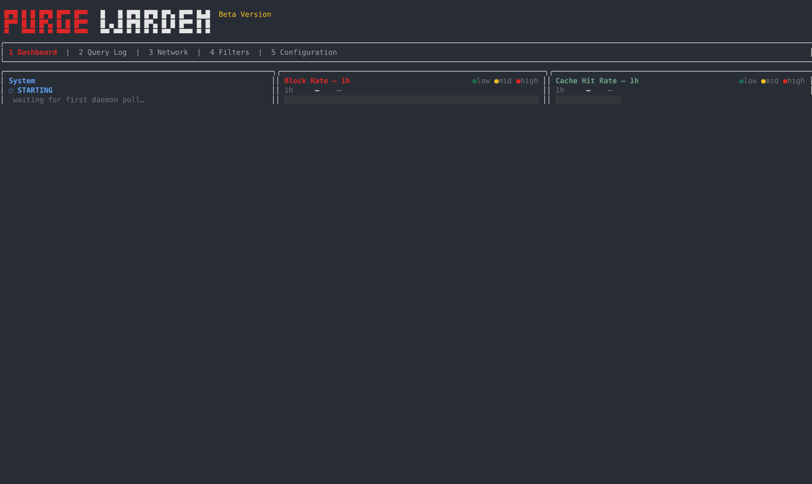
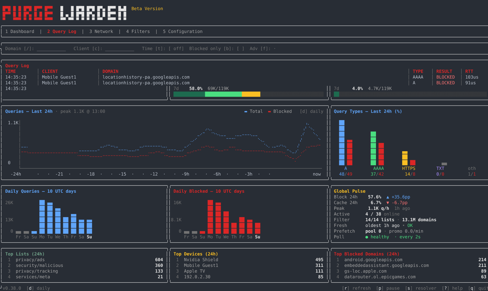
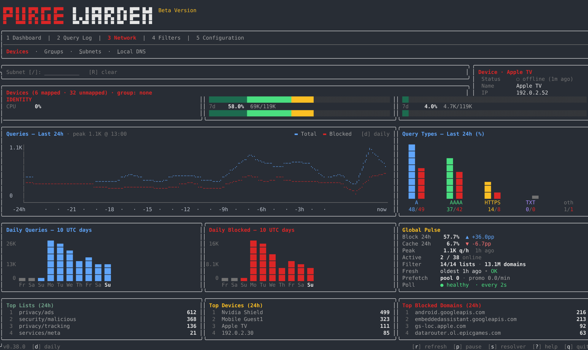
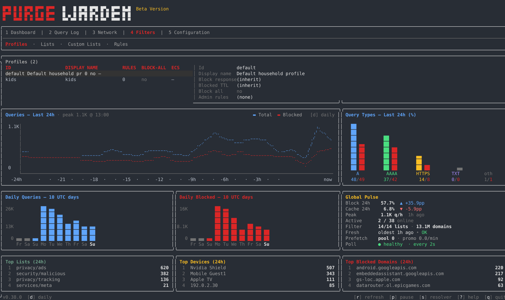

<p align="center">
  
  
</p>

<h1 align="center">warden</h1>

<p align="center">
  <strong>DNS filtering for the whole network.</strong><br>
  A Pi-hole / AdGuard Home alternative in Rust: one binary, one TOML file,<br>
  a systemd service, and a terminal dashboard.<br>
  No cloud account, no telemetry, no Docker, no database.
</p>

<p align="center">
  <a href="LICENSE"></a>
  <a href="https://get.purge.cc"></a>
  <a href="https://purge.cc"></a>
</p>

<p align="center">
  <a href="https://purge.cc">website</a> ·
  <a href="https://lists.purge.cc">lists</a> ·
  <a href="https://get.purge.cc">installer</a> ·
  <a href="docs/CONFIG_GUIDE.md">config guide</a>
</p>

<p align="center">
  
</p>

<p align="center"><sub>The real <code>warden dashboard</code> — recorded from a running resolver, not a mockup.</sub></p>

## Install

```bash
curl -fsSL https://get.purge.cc | sudo sh
```

Downloads the release for this machine (`x86_64` or `aarch64`), checks SHA-256, and runs the installer. It detects the LAN, writes a working config, installs the hardened systemd unit, and proves filtering with a live `dig`.

Linux + systemd, and a free port 53. Preview first:

```bash
curl -fsSL https://get.purge.cc | sudo sh -s -- --dry-run
```

### From this repo

```bash
git clone https://github.com/purge-cc/Warden.git
cd Warden
cargo build --release
sudo ./scripts/install.sh --build-from-source
```

Toolchain notes: [BUILDING.md](BUILDING.md). Later: `sudo ./scripts/install.sh --upgrade`. Remove: `sudo ./scripts/uninstall.sh` (`--purge` also wipes state).

### Verify

```bash
dig @127.0.0.1 example.com          # resolves — a real A record
dig @127.0.0.1 doubleclick.net      # blocked — 0.0.0.0
sudo warden dashboard               # terminal UI
```

Point the LAN DHCP/DNS at this host. A default profile is already wired, so the network is filtered from the first query.

## What you get

- **Network-wide blocking** — ads, trackers, malware. No per-device apps. Lists from [lists.purge.cc](https://lists.purge.cc), plus any file or URL you trust.
- **Different rules for different people** — profiles, bedtime schedules, per-device exceptions. Kids, guests, and the work laptop do not share one policy.
- **A TUI instead of a web panel** — `warden dashboard` over SSH: query log, devices, lists, rules. Every change is a TOML edit plus a reload. No hidden live state.
- **Encrypted upstreams** — DNS-over-HTTPS, DNS-over-TLS, or plain DNS, with a fallback chain. Warden is a filtering *forwarder*, not a recursive resolver; point it at Unbound if you want recursion.
- **Hardened by default** — external lists cannot sneak in `@@` / `$important` / regex; CNAME cloaking is inspected; list downloads are HTTPS-only; the systemd unit ships 25+ sandbox directives.

Commented options: [`config/default.toml`](config/default.toml). How config is meant to be used: [`docs/CONFIG_GUIDE.md`](docs/CONFIG_GUIDE.md). `warden --help` is the CLI source of truth.

<p align="center">
  
  &nbsp;
  
</p>
<p align="center">
  
</p>

## Requirements

- Linux with systemd (Debian 12+, Ubuntu 22.04+, Fedora 40+, RHEL 9+ and derivatives)
- Port 53 (the installer can silence `systemd-resolved`'s stub listener)
- A few hundred MB of RAM for typical home lists; a Pi 4 is plenty

**Not in this repo:** a web UI, Docker images, or a recursive DNS server.

## Build from source

```bash
./scripts/check_no_raw_fs_write.sh
cargo fmt --check
cargo clippy --all-targets
cargo test
```

Static ARM binary:

```bash
rustup target add aarch64-unknown-linux-musl
cargo build --release --target aarch64-unknown-linux-musl
```

## Security

See [SECURITY.md](SECURITY.md) for the threat model and how to report a vulnerability. Do not open a public issue for security problems.

## License

Licensed under [AGPL-3.0-or-later](LICENSE). Anyone who runs a modified purge-warden as a network service must offer users its source (AGPL §13).

The **purge** and **warden** names and logos are trademarks of purge.cc and are **not** covered by the AGPL — see [TRADEMARK.md](TRADEMARK.md). You may fork the code; you may not fork the brand.

## Contributing

Bug reports and pull requests are welcome. See [CONTRIBUTING.md](CONTRIBUTING.md) and the [code of conduct](CODE_OF_CONDUCT.md).
